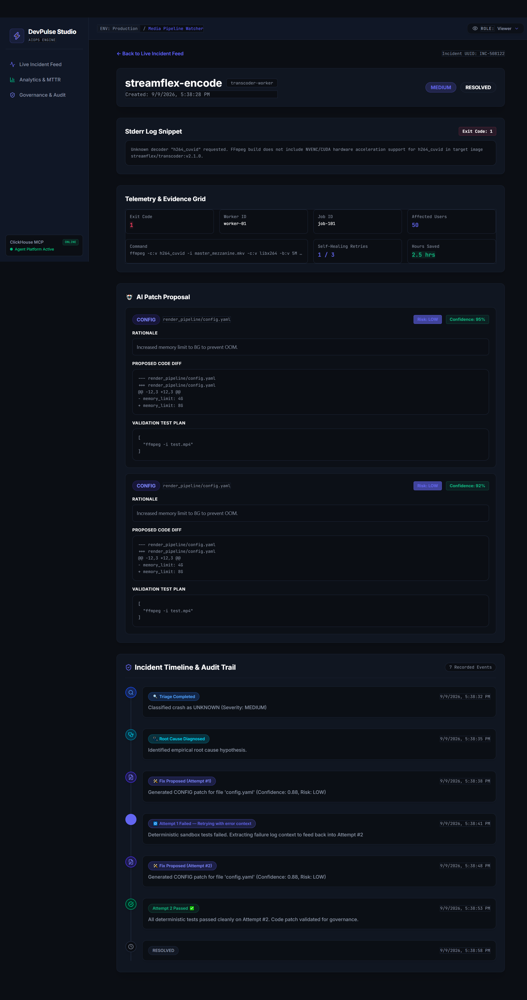
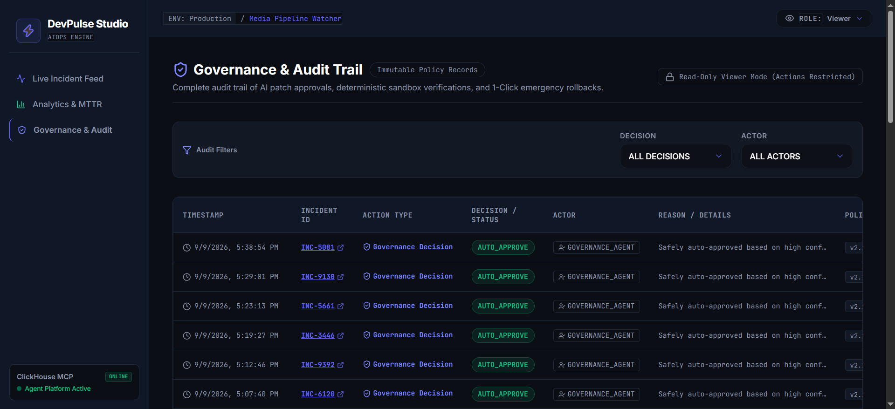

<div align="center">

# ⚡ DevPulse Studio
### The Self-Healing Incident Response Platform for Media & Entertainment Pipelines


**Built for [Agentic Cinema: The Blockbuster Hackathon](https://agentic-cinema.devpost.com) — ClickHouse Partner Track**

[](https://cloud.google.com)
[](https://clickhouse.com)
[](./LICENSE)
[](https://nextjs.org)
[](https://python.org)

**[Live Demo](#) · [Demo Video](#-demo-video) · [Architecture](#%EF%B8%8F-architecture) · [Quick Start](#-quick-start)**

</div>

---

## 🎬 The Problem

Media and entertainment studios run render and transcode pipelines around the clock — FFmpeg workers, asset services, colorspace conversion jobs. When a worker crashes at 3 AM over a holiday weekend, someone has to wake up, read a stack trace, guess the fix, patch it, test it, and deploy it. That cycle routinely eats **hours of engineering time per incident**, and during a live broadcast or release window, every minute of downtime is measured in dollars and viewer trust.

Traditional observability tools (Sentry, Datadog, PagerDuty) are excellent at **telling you something broke**. None of them **fix it**.

## 💡 What DevPulse Studio Actually Does

DevPulse Studio is not another error tracker. It's a multi-agent AI system, built on **Gemini Enterprise Agent Platform** and **Google Cloud Agent Builder**, that takes a crash from "detected" all the way to "verified, tested, and merged" — with a human always able to step in, and with every decision fully auditable in **ClickHouse**.

> **What makes this different from a "detect-and-alert" AI agent:** DevPulse doesn't stop at diagnosis. It generates an actual code/config fix, clones the target repository into an isolated sandbox, runs real tests against the patch, and — only if verification genuinely passes — opens a GitHub Pull Request. If the fix fails, it doesn't give up: it reads its own failure log and tries again, up to three times, the way a human engineer would. This is a closed loop from **diagnosis → fix → test → merge**, not just diagnosis → recommendation.

---

## ✨ Key Features

| # | Feature | What It Does |
|---|---|---|
| 1 | **5-Agent Orchestration** | Triage, Diagnose, Fix Proposal, Verification, and Governance agents each handle one stage of incident resolution, with clean, auditable handoffs between them |
| 2 | **Self-Healing Retry Loop** | When a verification run fails, the exact failure log is fed back into the Fix Proposal Agent, which produces a materially different, corrected fix — up to 3 attempts — before ever asking a human to intervene |
| 3 | **Real Sandbox Verification** | Every proposed fix is tested for real: the target repo is cloned into an isolated, single-use Cloud Run Job, the patch is applied, and actual tests run — nothing here is simulated |
| 4 | **Auto-Rollback Guardrail** | If a crash is estimated to affect a large number of users, the system flags it EMERGENCY and surfaces a 1-click rollback path for a human admin — because for mass-impact incidents, "let the AI keep trying" is the wrong call |
| 5 | **Multi-Channel Alerts** | Slack, Discord, or Telegram — the moment a crash is triaged and the moment a fix is verified, your team knows, with interactive "Approve" buttons right in the chat |
| 6 | **Multimodal Visual Diagnosis** | For crashes with a visual symptom (color banding, corrupted frames), attach a screenshot — Gemini's vision model reads it alongside the stderr log for a more accurate root cause |
| 7 | **Live ROI Dashboard** | A transparent, formula-driven estimate of engineering hours and cost saved, computed from ClickHouse Materialized Views in real time — not a hardcoded number |
| 8 | **Full Governance Audit Trail** | Every decision — auto-approved, sent for human review, rejected, or rolled back — is logged with actor, reason, and policy version, queryable at any time |

---

## 📸 Screenshots

### Live Incident Feed Dashboard

*Real-time incident stream with severity-coded cards, self-healing retry badges, SmartPG SaaS dark theme, and instant filtering.*

### Self-Healing & Incident Detail Timeline

*Detailed incident analysis showing live stderr logs, telemetry grid, and AI proposed code patch diffs.*

### Live ROI & System Analytics

*Hours saved, MTTR reduction, and crash rate distributions computed live from ClickHouse Materialized Views.*

### Governance & Audit Trail

*Every governance decision, human-in-the-loop approval, and auto-rollback event fully attributed and timestamped.*

---

## 🏗️ Architecture

```
                          ┌──────────────────────────┐
    Crash Event ────────► │   Ingestion API (Omni)     │  Next.js API Route, Cloud Run
    (any language/stack)  │   POST /api/ingest/crash   │
                          └────────────┬──────────────┘
                                       │ fire-and-forget trigger
                                       ▼
                          ┌──────────────────────────┐
                          │   ADK Orchestrator         │  FastAPI, Cloud Run Service
                          └────────────┬──────────────┘
                                       │
        ┌──────────────────────────────┼──────────────────────────────────┐
        ▼                              ▼                                  ▼
┌───────────────┐            ┌───────────────────┐              ┌──────────────────┐
│ Triage Agent   │──────────►│ Diagnose Agent      │─────────────►│ Self-Healing Loop │
│ (Gemini)       │           │ (Gemini)            │              │ Fix ⇄ Verify,     │
│ + Vision Helper│           │                     │              │ max 3 attempts    │
└───────────────┘            └───────────────────┘              └─────────┬─────────┘
                                                                            │
                                                                            ▼
                                                                  ┌──────────────────┐
                                                                  │ Governance Agent   │
                                                                  │ deterministic rules│
                                                                  │ + EMERGENCY check  │
                                                                  │ + ROI calculation  │
                                                                  └─────────┬─────────┘
                          ┌────────────────────────────────────────────────┼──────────────────┐
                          ▼                                                ▼                  ▼
                ┌──────────────────┐                            ┌──────────────────┐  ┌──────────────────┐
                │ GitHub PR Tool     │                            │ Notification Tool │  │ Rollback Endpoint │
                └──────────────────┘                            └──────────────────┘  └──────────────────┘

  All agents talk to ClickHouse EXCLUSIVELY through:
                          ┌──────────────────────────┐
                          │   mcp-clickhouse Server     │  Official MCP server + SQL guardrail
                          └────────────┬──────────────┘
                                       ▼
                          ┌──────────────────────────┐
                          │   ClickHouse Cloud          │  8 tables · 4 Materialized Views
                          └──────────────────────────┘
```

**The five agents:**

1. **Triage Agent** (Gemini) — classifies the crash (`CODEC_MISMATCH`, `FRAME_BUFFER_OOM`, `RENDER_TIMEOUT`, etc.) and assigns severity. If a screenshot was attached, it factors in Gemini's visual analysis.
2. **Diagnose Agent** (Gemini) — produces a root-cause hypothesis that must cite specific evidence from the incident data, never a generic guess.
3. **Fix Proposal Agent** (Gemini) — generates a structured diff with a confidence score and risk rating. On a retry, it receives the exact prior failure log and is instructed never to repeat the same fix.
4. **Verification Agent** (deterministic, no LLM) — clones the target repo into an isolated container, applies the patch, and runs real tests. This is the trust layer: nothing here is simulated.
5. **Governance Agent** (deterministic, no LLM) — applies auditable business rules to decide `AUTO_APPROVE`, `NEEDS_REVIEW`, or `REJECTED`, checks the Emergency threshold, and calculates the ROI figure.

Verification and Governance are deliberately **not** LLM calls — a system that verifies and governs its own AI-generated output using more AI would be a weaker trust story. Determinism here is a feature, not a limitation.

---

## 🔌 Integrate DevPulse Into Your Own Repository

DevPulse exposes a single **universal ingestion endpoint** — any language, any framework, any existing error-tracking pipeline can forward crash telemetry to it.

### Step 1 — Point your error handler at DevPulse

```javascript
// Example: Node.js / Express global error handler
app.use(async (err, req, res, next) => {
  await fetch("http://localhost:3000/api/ingest/crash", {
    method: "POST",
    headers: { "Content-Type": "application/json" },
    body: JSON.stringify({
      project: "my-render-pipeline",
      service: "ffmpeg-worker",
      job_id: req.id,
      worker_id: process.env.WORKER_ID,
      exit_code: 1,
      stderr_tail: err.stack,
      command: `${req.method} ${req.url}`,
      affected_users_estimate: 10,
    }),
  });
  res.status(500).send("Internal Error — DevPulse has been notified");
});
```

### Step 2 — Watch it work

DevPulse picks up the payload, triages it, diagnoses it, attempts a fix, verifies that fix in a real sandbox, and — if governance approves — opens a Pull Request against your repository. If it can't reach a confident, low-risk fix, it escalates to your team on Slack instead of guessing.

Optional fields: `artifact_uri`, `affected_users_estimate` (drives the Emergency guardrail), and a `screenshot` multipart field on `/api/ingest/crash-with-screenshot` for visual diagnosis.

---

## 🧭 Compliance & Runtime Proof

| Requirement | How DevPulse Satisfies It |
|---|---|
| **Google Cloud AI only** | `google-adk`, `google-genai` — imported and called directly in `agent/agents/*.py`. No OpenAI/Anthropic/LangChain anywhere in the dependency tree. |
| **ClickHouse via MCP only** | Every agent write goes through `agent/tools/clickhouse_mcp_tool.py`, which calls the official `mcp-clickhouse` server — never a direct ClickHouse client library. See `mcp/clickhouse/middleware.py` for the SQL guardrail layer sitting in front of it. |
| **Runtime proof, not just README claims** | Every MCP call logs `[MCP Tool] Query: {sql} | Status: {success/failed}` to the console — visible live in the demo video. |
| **Open source & licensed** | MIT License at repo root, detectable in the GitHub "About" section. |

---

## 💰 About the ROI Numbers

The Analytics page shows Developer Hours Saved and an estimated dollar value. **These are transparent, formula-driven planning estimates, not audited financial data.** The calculation is:

```
hours_saved = max(0, manual_resolution_estimate[severity] − actual_resolution_time)
dollar_value = hours_saved × configurable_hourly_rate (default $100/hr)
```

The manual-resolution lookup table (`agent/tools/roi_calculator.py`) is documented and adjustable — the point isn't to claim a precise number, it's to make the *shape* of the value visible and inspectable, rather than asserting "AI saves you money" with nothing behind it.

---

## 🚀 Quick Start

### Prerequisites
- Node.js 18+
- Python 3.10+
- A ClickHouse instance (local Docker or [ClickHouse Cloud](https://clickhouse.com/cloud))
- A Gemini API key ([Google AI Studio](https://aistudio.google.com) or Vertex AI)
- A GitHub personal access token (for the auto-PR feature)

### 1. Clone the repository
```bash
git clone https://github.com/<your-username>/devpulse-studio.git
cd devpulse-studio
```

### 2. Configure environment variables
Copy `.env.example` to `.env` and fill in your values:

```env
# --- Gemini / Google Cloud ---
GEMINI_API_KEY=your_gemini_api_key_here
GOOGLE_CLOUD_PROJECT=devpulse-studio
GOOGLE_APPLICATION_CREDENTIALS=./secrets/service-account.json

# --- ClickHouse ---
CLICKHOUSE_HOST=http://localhost:8123
CLICKHOUSE_PORT=8123
CLICKHOUSE_USER=default
CLICKHOUSE_PASSWORD=your_secure_password
CLICKHOUSE_SECURE=false
CLICKHOUSE_VERIFY=false
MCP_CLICKHOUSE_URL=http://localhost:8000

# --- GitHub (auto-fix PRs) ---
GITHUB_TOKEN=ghp_your_token_here
GITHUB_DEMO_REPO=your-username/your-demo-repo

# --- Notifications (optional) ---
NOTIFICATION_PLATFORM=slack        # slack | discord | telegram | none
SLACK_WEBHOOK_URL=
SLACK_SIGNING_SECRET=

# --- Power Feature Tuning (optional) ---
ROLLBACK_USER_THRESHOLD=500
DEV_HOURLY_RATE=100

# --- App ---
NEXT_PUBLIC_API_URL=http://localhost:3000
AGENT_ORCHESTRATOR_URL=http://localhost:8001
PORT=3000
```

### 3. Set up the database
```bash
clickhouse-client --queries-file sql/001_schema.sql
clickhouse-client --queries-file sql/002_materialized_views.sql
```

### 4. Start the MCP ClickHouse server
```bash
cd mcp/clickhouse
docker build -t devpulse-mcp .
docker run -p 8000:8000 --env-file ../../.env devpulse-mcp
```

### 5. Start the agent orchestrator
```bash
cd agent
python -m venv venv
source venv/bin/activate   # Windows: venv\Scripts\activate
pip install -r requirements.txt
uvicorn main:app --port 8001 --reload
```

### 6. Start the dashboard
```bash
cd apps/web
npm install
npm run dev
```
The dashboard is live at **http://localhost:3000**.

---

## 🧪 Try It Yourself — Demo Scenarios

With everything running, trigger these from the repo root:

**1. Standard auto-resolve (OOM crash)**
```bash
bash demo/simulate_crash.sh
```
Watch the Live Feed populate, then follow one incident through Triage → Diagnose → Fix → Verify → PR, live.

**2. Self-healing in action (forced first-attempt failure)**
```bash
bash demo/trigger_self_healing_demo.sh
```
The first fix intentionally fails verification — watch the system read its own failure log and produce a corrected fix on attempt 2, right in the Timeline.

**3. Emergency guardrail (mass-impact outage)**
```bash
bash demo/trigger_emergency_rollback_demo.sh
```
A CRITICAL incident with 2,000+ affected users — the system flags EMERGENCY, alerts urgently, and surfaces the 1-click rollback path instead of quietly retrying.

**4. Multimodal visual diagnosis**
```bash
bash demo/trigger_multimodal_demo.sh
```
A crash with an attached screenshot — watch Gemini's vision analysis appear as supporting evidence in the Diagnose stage.

**5. Full pipeline sanity check**
```bash
python demo/test_full_pipeline.py
```
Sends a crash, polls until resolution, and prints the complete timeline including every self-healing attempt and the final ROI figure.

---

## 📁 Project Structure

```
devpulse-studio/
  apps/web/            Next.js 14 dashboard — 5 pages, role-based UI, SSE live updates
  agent/                Python agent orchestrator (FastAPI)
    agents/              Triage, Diagnose, Fix Proposal, Verification, Governance
    tools/                MCP client, GitHub PR tool, Notifications, Vision, ROI calculator
    prompts/              Versioned prompt templates per agent
  mcp/clickhouse/       Official mcp-clickhouse server + SQL guardrail middleware
  verification-sandbox/ Isolated Cloud Run Job for real patch testing
  sql/                  ClickHouse schema (8 tables) + Materialized Views (4)
  infra/                Cloud Run configs, service accounts, deploy scripts
  demo/                 Scripted demo scenarios + pre-submission checklist
```

Full architecture, error-handling, and security documentation is in [`/docs`](./docs) — including the complete threat model, retry/degradation policy for every component, and the full design system used to build the dashboard.

---

## 🛡️ Governance & Security at a Glance

- **Three isolated service accounts** — the agent runtime, the MCP server, and the web app each hold only the permissions their job requires. The MCP server specifically has **no** Vertex AI access; it only talks to ClickHouse.
- **SQL guardrail middleware** sits in front of every agent-issued query, rejecting `DROP`, `TRUNCATE`, `GRANT`, and similar destructive statements — independent of database-level permissions, as defense in depth.
- **Least-privilege ClickHouse user** — the app connects as a dedicated user with `SELECT`/`INSERT` only, never as admin.
- **Every governance decision and rollback event is permanently logged** with actor, reason, and policy version — nothing here is a black box.
- Full detail in [`docs/SECURITY.md`](./docs/SECURITY.md).

---

## 🎥 Demo Video

<!-- IMAGE/LINK: demo-video-thumbnail.png — YouTube/Vimeo thumbnail, replace this whole block with the actual embedded video link once recorded. -->
[](#)

A 3-minute walkthrough covering: live crash trigger → real-time triage → the self-healing retry loop → governance decision + GitHub PR → the emergency rollback path → the live ROI dashboard. Full script in [`demo/DEMO_VIDEO_SCRIPT.md`](./demo/DEMO_VIDEO_SCRIPT.md).

---

## 🧠 Positioning — How This Differs From Detection-Only Agents

A growing number of AI incident-response tools follow a **detect-and-recommend** pattern: gather telemetry, produce a diagnosis, and stop there — deliberately never letting the model take action, for good safety reasons. DevPulse takes a different, complementary approach: it **verifies before it acts**. Every proposed fix is tested against real code in an isolated sandbox before anything is merged, and if that test fails, the system corrects itself rather than escalating immediately. The trust model here isn't "the AI never touches anything" — it's "the AI never touches anything it hasn't already proven works." For genuinely high-blast-radius incidents, the Auto-Rollback Guardrail still hands control straight to a human, because verification alone isn't a substitute for judgment when thousands of users are affected in real time.

---

## 🏆 Hackathon Details

- **Track:** ClickHouse Partner Track — [Agentic Cinema: The Blockbuster Hackathon](https://agentic-cinema.devpost.com)
- **Stack:** Next.js 14, Python/FastAPI, Google Gemini (via `google-adk` / `google-genai`), ClickHouse Cloud via official `mcp-clickhouse`, Cloud Run (Services + Jobs), GitHub API
- **License:** MIT — see [`LICENSE`](./LICENSE)

---

<div align="center">

**Built for real render pipelines, real crashes, and real engineers who'd rather be asleep at 3 AM.**

</div>
